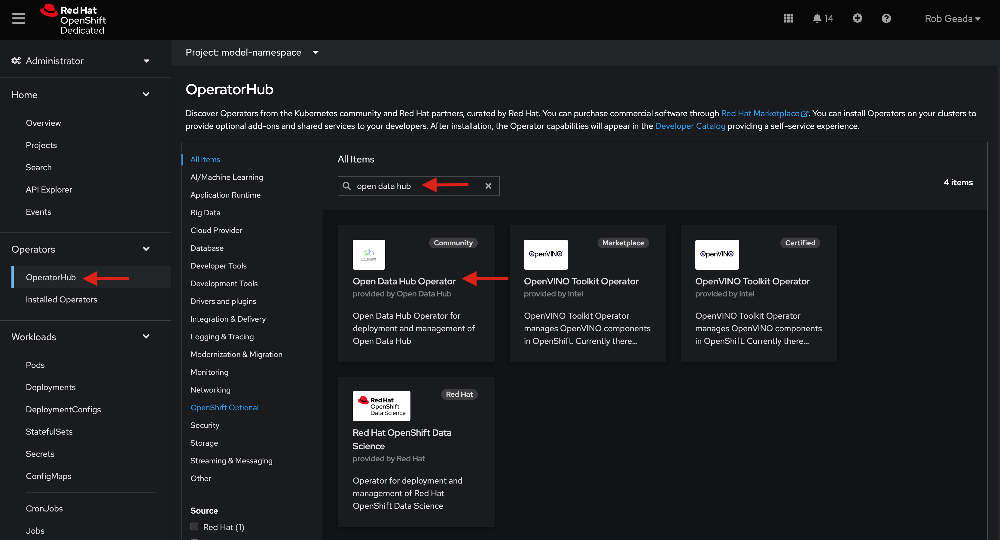
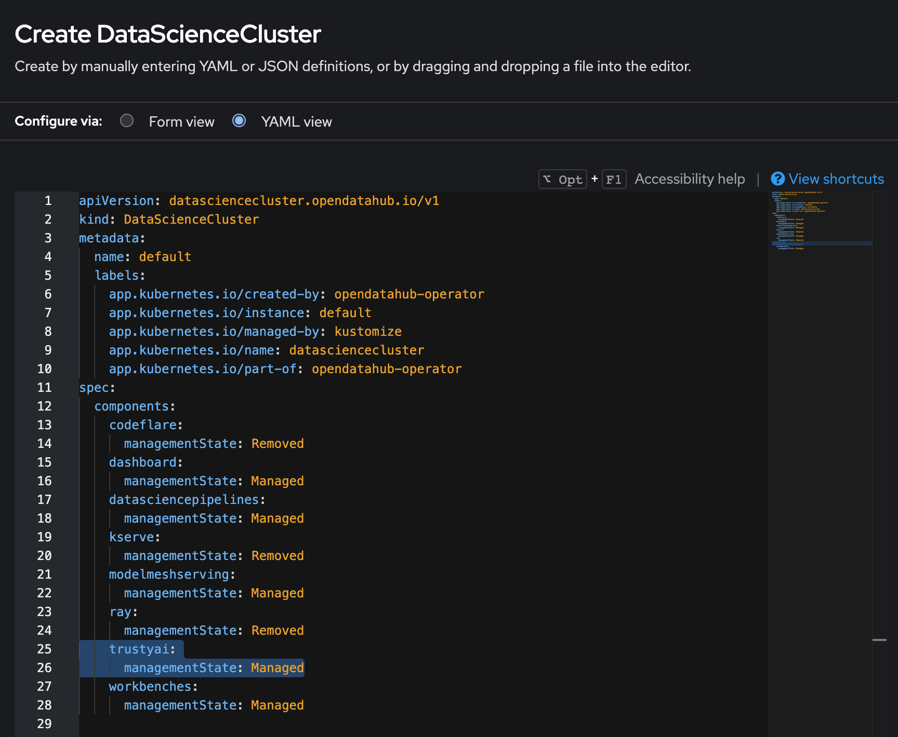

# Installing ODH and TrustyAI
This guide will walk through installing Open Data Hub and TrustyAI into your cluster. Starting from a completely
blank cluster, you will be left with:
1) An Open Data Hub installation
2) A namespace to deploy models into
3) A TrustyAI Operator, to manage all instances of the TrustyAI Service
4) A TrustyAI Service, to monitor and analyze all the models deployed into your model namespace.

## Cluster Setup
1) Make sure you are `oc login`'d to your OpenShift cluster
2) Create two projects, `opendatahub` and `model-namespace`. These names are arbitrary, but I'll be using them throughout the rest of this demo:
   1) `oc new-project opendatahub`
   2) `oc new-project model-namespace`
3) Prepare the `model-namespace` for ODH's model serving: `oc label namespace model-namespace "modelmesh-enabled=true" --overwrite=true`

## Enable User-Workload-Monitoring
To get enable ODH's monitoring stack , user-workload-monitoring must be configured:
1) Enable user-workload-monitoring: `oc apply -f resources/enable_uwm.yaml`
2) Configure user-workload-monitoring to hold metric data for 15 days: `oc apply -f resources/uwm_configmap.yaml`

Depending on how your cluster was created, you may need to enable a User Workload Monitoring setting from 
your cluster management UI (for example, on console.redhat.com)

## Install ODH Operator
1) From the OpenShift Console, navigate to "Operators" -> "OperatorHub", and search for "Open Data Hub"
   
2) Click on "Open Data Hub Operator". 
   1) If the "Show community Operator" warning opens, hit "Continue"
   2) Hit "Install". 
3) From the "Install Operator" screen:
   1) Make sure "All namespaces on the cluster" in selected as the "Installation Mode":
   2) Hit install
4) Wait for the Operator to finish installing

## ODH v2.x
If the provided ODH version in your cluster's OperatorHub is version 2.x, use the following steps:

### ODH Prerequisties
1) Install the community Authorino Operator. At the time of writing, Authorino 0.11.1 is verified to be compatible.
2) Install the Red Hat OpenShift Serverless operator.
3) Install the  Red Hat OpenShift Service Mesh operator.

### Install ODH (ODH v2.x)
1) Navigate to your `opendatahub` project
2) From "Installed Operators", select "Open Data Hub Operator".
3) Navigate to the "DSC Initialization" tab and hit "Create DSCInitialization", then install the default DSCI. Once the DSCI reports "Ready", move on to step 4. 
4) Navigate to the "Data Science Cluster" tab and hit "Create DataScienceCluster"
5) In the YAML view Make sure `trustyai` is set to `Managed`:

6) Hit the "Create" button
7) Within the "Pods" menu, you should begin to see various ODH components being created, including the `trustyai-service-operator-controller-manager-xxx`

### Install TrustyAI (ODH v2.x)
1) Navigate to your `model-namespace` project: `oc project model-namespace`
2) Run `oc apply -f resources/trustyai_crd.yaml`. This will install the TrustyAI Service
into your `model-namespace` project, which will then provide TrustyAI features to all subsequent models deployed into that project, such as explainability, fairness monitoring, and data drift monitoring, 

# Legacy Installation Steps
## ODH v1.x (legacy)
If the provided ODH version in your cluster's OperatorHub is version 1.x, use the following steps:
### Install ODH (ODH v1.x)
1) Navigate to your `opendatahub` project
2) From "Installed Operators", select "Open Data Hub Operator".
3) Navigate to the "Kf Def" tab
   1) Hit "Create KfDef"
   2) Hit "Create" without making any changes to the default configuration
4) Within the "Pods" menu, you should begin to see various ODH components being created

### Install TrustyAI (ODH v1.x)
1) Navigate to your `opendatahub` project: `oc project opendatahub`
2) Run `oc apply -f resources/trustyai_operator_kfdef.yaml`. This will install the TrustyAI Operator
into your `opendatahub` namespace alongside the ODH installation. 
3) Within the "Pods" menu, you should see the TrustyAI Operator pod being created
4) Navigate to your `model-namespace` project: `oc project model-namespace`
5) Run `oc apply -f resources/trustyai_crd.yaml`. This will install the TrustyAI Service
into your `model-namespace` project, which will then provide TrustyAI features to all subsequent models deployed into that project, such as explainability, fairness monitoring, and data drift monitoring, 
