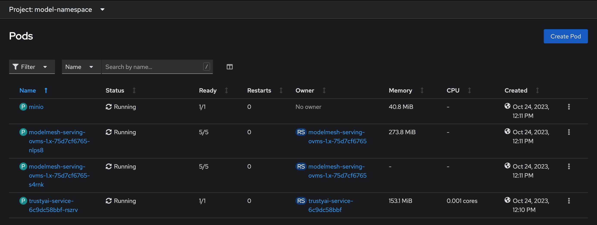
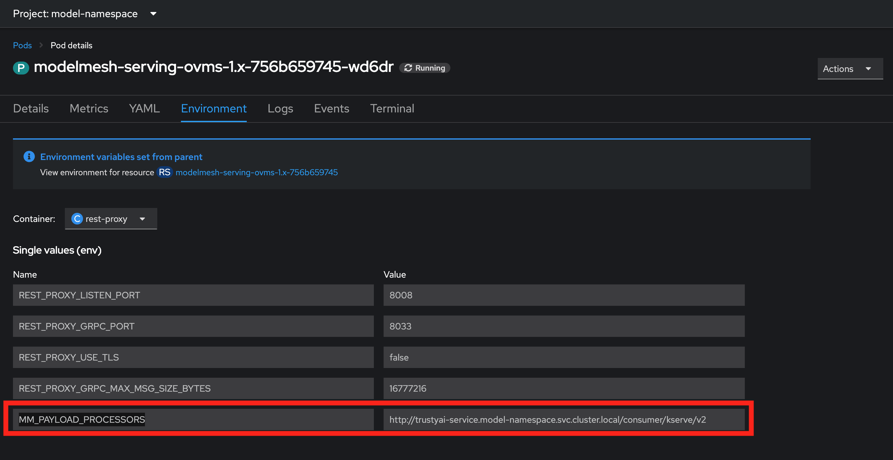
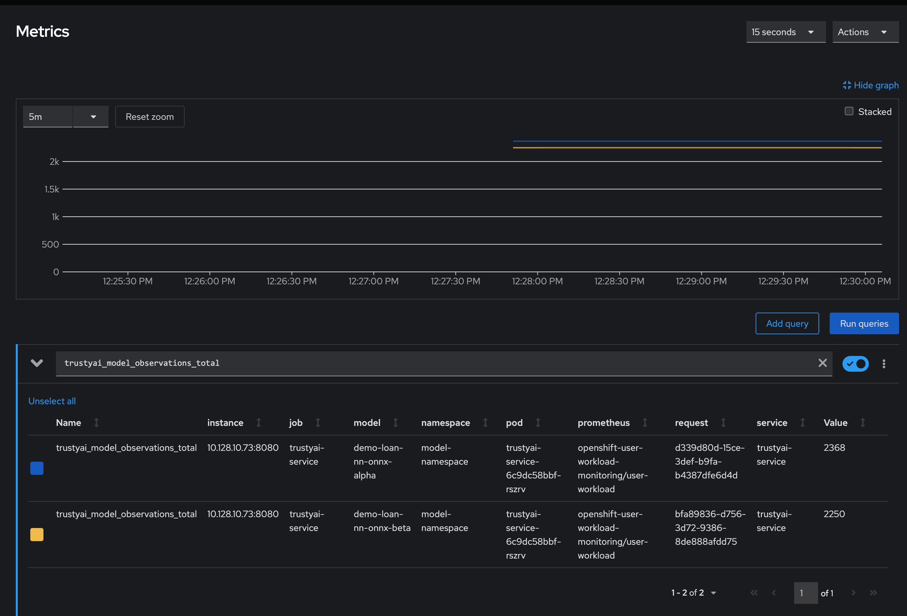
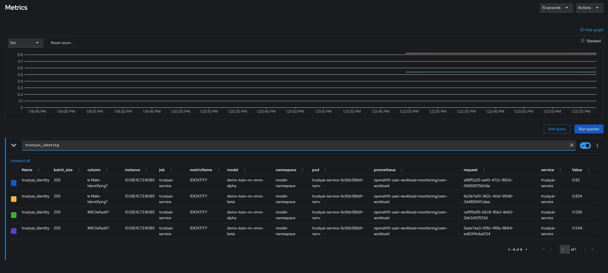
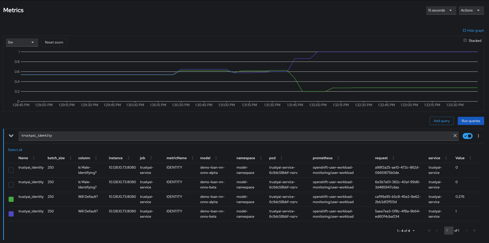

# Bias Monitoring via TrustyAI in ODH
This demo will explore using TrustyAI to monitor models for bias. 

## Context
We will take on the 
persona of a dev-ops engineer for a credit lender. Our data scientists have created two 
candidate neural networks to predict if a borrower will default on the loan they hold with us. Both models
use the following information about the applicant to make their prediction:

* Number of Children
* Total Income:
* Number of Total Family Members
* Is Male-Identifying?
* Owns Car?
* Owns Realty?
* Is Partnered?
* Is Employed?
* Lives with Parents?
* Age (in days)
* Length of Employment (in days)

What we want to verify is that neither of our models are not biased over the gender field of `Is Male-Identifying?`. To do this,
we will monitor our models with *Statistical Parity Difference (SPD)* metric, which will tell us how the difference betweem how often 
male-identifying and non-male-identifying applicants are given favorable predictions (i.e., they are predicted
to pay back their loans). Ideally, the SPD value would be 0, indicating that both groups have equal likelihood of getting a good outcome. However, an SPD value between -0.1 and 0.1 is also indicative of reasonable fairness,
indicating that the two groups' rates of getting good outcomes only varies by +/-10%.


## Setup
Follow the instructions within the [Installation section](../Installation/Installation.md). Afterwards,
you should have an ODH installation, a TrustyAI Operator, and a `model-namespace` project containing
an instance of the TrustyAI Service.

## Deploy Models
1) Navigate to the `model-namespace` created in the setup section: `oc project model-namespace`
2) Deploy the model's storage container: `oc apply -f resources/model_storage_container`
3) Deploy the OVMS 1.x serving runtime: `oc apply -f resources/ovms-1.x.yaml`
4) Deploy the first model: `oc apply -f resources/model_alpha.yaml`
5) Deploy the second model: `oc apply -f resources/model_beta.yaml`
6) From the OpenShift Console, navigate to the `model-namespace` project and look at the Workloads -> Pods screen.
   1) You should see four pods: 
   2) Once the TrustyAI Service registers the deployed models, you will see the `
modelmesh-serving-ovms-1.x-xxxxx` pods get re-deployed. 
   3) Verify that the models are registered with TrustyAI by selecting one of the `modelmesh-serving-ovms-1.x-xxxxx` pods. In the Environment tab, if the field `MM_PAYLOAD_PROCESSORS` is set, then your models are successfully registered with TrustyAI: 

## Send Training Data to Models
Here, we'll pass all the training data through the models, such as to be able to compute baseline fairness values:

```shell
for batch in 0 250 500 750 1000 1250 1500 1750 2000 2250; do
  scripts/send_data_batch data/training/$batch.json
done
```

This will take a few minutes. The script will print out verification messages indicating whether TrustyAI is receiving the data, but we can also verify in the Cluster Metrics:
1) Navigate to Observe -> Metrics in the OpenShift console.
2) Set the time window to 5 minutes (top left) and the refresh interval to 15 seconds (top right)
3) In the "Expression" field, enter `trustyai_model_observations_total` and hit "Run Queries". You should see both models listed, each reporting around 2250 observed inferences: . This means that TrustyAI has catalogued 2250 inputs and outputs for each of the two models, more than enough to begin analysis.

## Examining TrustyAI's Model Metadata
We can also verify that TrustyAI sees the models via the `/info` endpoint:
1) Find the route to the TrustyAI Service: `TRUSTY_ROUTE=https://$(oc get route/trustyai-service --template={{.spec.host}})`
2) Query the `/info` endpoint: `curl $TRUSTY_ROUTE/info | jq ".[0].data"`. This will output a json file ([sample provided here](resources/info_response.json)) containing the following information for each model:
   1) The names, data types, and positions of fields in the input and output 
   2) The observed values that these fields take
   3) The total number of input-output pairs observed
   
## Label Data Fields
As you can see, our models have not provided particularly useful field names for our inputs and outputs (all some form of `customer_data+input-x`). We can apply a set of _name mappings_ to these to apply meaningful names to the fields. This is done via POST'ing the `/info/names` endpoint:

`./scripts/apply_name_mapping.sh`

Explore the [apply_name_mapping.sh](scripts/apply_name_mapping.sh) script to understand how the payload is structured.

## Check Model Fairness
To compute the model's cumulative fairness up to this point, we can check the `/metrics/group/fairness/spd` endpoint:

```shell
echo "=== MODEL ALPHA ==="
curl -sk  -X POST --location $TRUSTY_ROUTE/metrics/group/fairness/spd/ \
     --header 'Content-Type: application/json' \
     --data "{
                 \"modelId\": \"demo-loan-nn-onnx-alpha\",
                 \"protectedAttribute\": \"Is Male-Identifying?\",
                 \"privilegedAttribute\": 1.0,
                 \"unprivilegedAttribute\": 0.0,
                 \"outcomeName\": \"Will Default?\",
                 \"favorableOutcome\": 0,
                 \"batchSize\": 5000
             }" 
        
echo "\n=== MODEL BETA ==="     
curl -sk  -X POST --location $TRUSTY_ROUTE/metrics/group/fairness/spd \
     --header 'Content-Type: application/json' \
     --data "{
                 \"modelId\": \"demo-loan-nn-onnx-beta\",
                 \"protectedAttribute\": \"Is Male-Identifying?\",
                 \"privilegedAttribute\": 1.0,
                 \"unprivilegedAttribute\": 0.0,
                 \"outcomeName\": \"Will Default?\",
                 \"favorableOutcome\": 0,
                 \"batchSize\": 5000
             }"           
```
The payload is structured as follows:
* `modelId`: The name of the model to query
* `protectedAttribute`: The name of the feature that distinguishes the groups that we are checking for fairness over. 
* `privilegedAttribute`: The value of the `protectedAttribute` the describes the suspected favored (positively biased) class. 
* `unprivilegedAttribute`: The value of the `protectedAttribute` the describes the suspected unfavored (negatively biased) class. 
* `outcomeName`: The name of the output that provides the output we are examining for fairness. 
* `favorableOutcome`: The value of the `outcomeName` output that describes the favorable or desired model prediction.
* `batchSize`: The number of previous inferences to include in the calculation.

These requests will return the following messages:
### Model Alpha
```json
{
   "timestamp":"2023-10-24T12:06:04.586+00:00",
   "type":"metric",
   "value":-0.0029676404469311524,
   "namedValues":null,
   "specificDefinition":"The SPD of -0.002968 indicates that the likelihood of Group:Is Male-Identifying?=1.0 receiving Outcome:Will Default?=0 was -0.296764 percentage points lower than that of Group:Is Male-Identifying?=0.0.",
   "name":"SPD",
   "id":"d2707d5b-cae9-41aa-bcd3-d950176cbbaf",
   "thresholds":{"lowerBound":-0.1,"upperBound":0.1,"outsideBounds":false}
}
```
### Model Beta
```json
{
   "timestamp":"2023-10-24T12:06:04.930+00:00",
   "type":"metric",
   "value":0.027796371582978097,
   "namedValues":null,
   "specificDefinition":"The SPD of 0.027796 indicates that the likelihood of Group:Is Male-Identifying?=1.0 receiving Outcome:Will Default?=0 was 2.779637 percentage points higher than that of Group:Is Male-Identifying?=0.0.",
   "name":"SPD",
   "id":"21252b73-651b-4b09-b3af-ddc0be0352d8",
   "thresholds":{"lowerBound":-0.1,"upperBound":0.1,"outsideBounds":false}
}
```
The `specificDefinition` field is quite useful in understanding the real-world interpretation of these metric values. From these, we see that both model Alpha and Beta are quite fair over the 
`Is Male-Identifying?` field, with the two groups' rates of positive outcomes only differing by -0.3% and 2.8% respectively. 

## Schedule a Fairness Metric Request
However, while it's great that our models are fair over the training data, we need to monitor that they remain fair over real-world inference data as well. To do this, we can _schedule_ some metric requests,
such as to compute at recurring intervals throughout deployment. To do this, we simply pass the same payloads to the `/metrics/group/fairness/spd/request` endpoint:

```shell
echo "=== MODEL ALPHA ==="
curl -sk  -X POST --location $TRUSTY_ROUTE/metrics/group/fairness/spd/request \
     --header 'Content-Type: application/json' \
     --data "{
                 \"modelId\": \"demo-loan-nn-onnx-alpha\",
                 \"protectedAttribute\": \"Is Male-Identifying?\",
                 \"privilegedAttribute\": 1.0,
                 \"unprivilegedAttribute\": 0.0,
                 \"outcomeName\": \"Will Default?\",
                 \"favorableOutcome\": 0,
                 \"batchSize\": 5000
             }" 
        
echo "\n=== MODEL BETA ==="     
curl -sk  -X POST --location $TRUSTY_ROUTE/metrics/group/fairness/spd/request \
     --header 'Content-Type: application/json' \
     --data "{
                 \"modelId\": \"demo-loan-nn-onnx-beta\",
                 \"protectedAttribute\": \"Is Male-Identifying?\",
                 \"privilegedAttribute\": 1.0,
                 \"unprivilegedAttribute\": 0.0,
                 \"outcomeName\": \"Will Default?\",
                 \"favorableOutcome\": 0,
                 \"batchSize\": 5000
             }"           
```
These commands will return the created request's IDs, which can later be used to delete these scheduled requests if desired. 

## Schedule an Identity Metric Request
Furthermore, let's monitor the average values of various data fields over time, to see the average ratio of loan-payback to loan-default predictions, as well as the average ratio of male-identifying to non-male-identifying applicants. We can do this by creating an _Identity Metric Request_ via POST'ing the `/metrics/identity/request` endpoint:

```shell
for model in "demo-loan-nn-onnx-alpha" "demo-loan-nn-onnx-beta"; do
  for field in "Is Male-Identifying?" "Will Default?"; do 
      curl -sk  -X POST --location $TRUSTY_ROUTE/metrics/identity/request \
       --header 'Content-Type: application/json' \
       --data "{
                 \"columnName\": \"$field\",
                 \"batchSize\": 250,
                 \"modelId\": \"$model\"
               }"
  done  
done  
```
The payload is structured as follows:
* `columnName`: The name of the field to compute the averaging over
* `batchSize`: The number of previous inferences to include in the average-value calculation
* `modelId`: The name of the model to query

## Check the Metrics
1) Navigate to Observe -> Metrics in the OpenShift console. If you're already on that page, you may need to refresh before the new metrics appear in the suggested expressions.
2) Set the time window to 5 minutes (top left) and the refresh interval to 15 seconds (top right)
3) In the "Expression" field, enter `trustyai_spd` or `trustyai_identity`
4) Explore the Metric Chart:



## Simulate Some Real World Data
 Now that we've got our metric monitoring set up, let's send some "real world" data through our models to see if they remain fair:
 
```shell
for batch in "01" "02" "03" "04" "05" "06" "07" "08"; do
  scripts/send_data_batch data/batch_$batch.json
  sleep 5
done
```
Once the data is being sent, return to  Observe -> Metrics page and watch the SPD and Identity metric values change.

## Results
Let's first look at our two models' fairness: 


Immediately, we notice that the two models have drastically different fairnesses over the real world data. Model Alpha (blue) remained within the "acceptably fair" range between -0.1 and 0.1, ending at around 0.09. However, Model Beta (yellow) plummeted out of the fair range, ending at -0.274, meaning that non-male-identifying applicants were _*27 percent*_ less likely to get a favorable outcome from the model than male-identifying applicants; clearly an unacceptable bias. 

We can investigate this further by examining our identity metrics, first looking at the inbound ratio of male-identifying to non-male-identufying applicants:


We can immediately see that in our training data, the ratio between male/non-male was around 0.8, but in the real-world data, it quickly dropped to _*0*_, meaning every single applicant was non-male. This is a strong indicator that our 
training data did not match our real-world data, which is very likely to indicate poor or biased model performance. 

Meanwhile, looking at the will-default to will-not-default ratio:

We can see that despite seeing only non-male applicants, Model Alpha (green) still provided varying outcomes to the various applicants, predicting "will-default" around 25% of the time. Model Beta (purple) predicted "will-default" 100% of the time: every single applicant was predicted to default on their loan. Again, this is a clear indicator that our model is performing poorly on the real-world data and/or has encoded a systematic bias from its training; it is predicting that every single non-male applicant will default. 

These examples show exactly why monitoring bias in production is so important: models that are equally fair at training time may perform _drastically_ differently over real-world data, with hidden biases only manifesting over real-world data. This means these biases are exposed to the public, being imposed upon whoever is subject to your models decisions, and therefore using TrustyAI to provide early warning of these biases can protect you from the damages that problematic models in production can do.